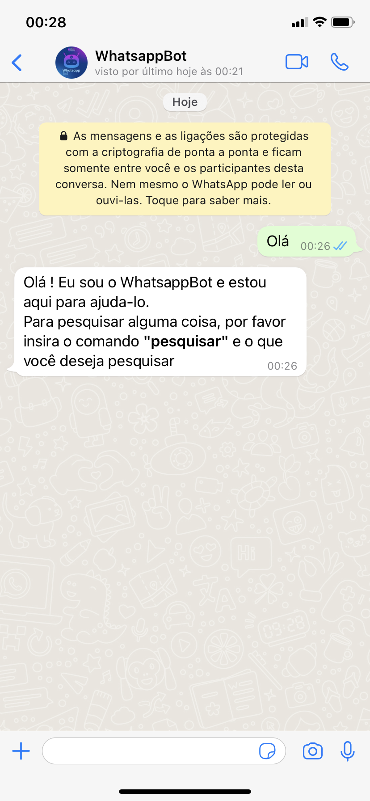

# WhatsappBot
>Um pequeno robô para Whatsapp, que auxilia na pesquisa de produtos pela internet. 

O Brasil se encontra na segunda posição global dentre os países que mais gastam tempo na Internet. Em média, os brasileiros passam 10 horas e 8 minutos por dia conectados, seja para trabalho ou lazer.

Tirar um tempo para navegar na internet e fazer aquela "comprinha" no melhor site e no melhor preço pode ser uma tarefa árdua. Por essa razão decidi criar o WhatsappBot !! Um robô que faz uma busca no **Zoom.br** do produto que você deseja comprar, retornando para você uma lista de produtos com preços e as lojas virtuais mais conceituada com o produto disponível.

Para realização desse projeto foi necessário usar o **Venom-Bot** para fazer integração com Whatsapp associado ao **Natural language processing** para deixar o bot mais um pouquinho inteligente (Não foi muita coisa, so brinquei um pouco rsrsrs). E uma das partes principais do projeto que é extração dessas inofrmações no site do **Zoom.br** utilizei o **Puppeteer**. Como bônus, deixei um servidor **Express** para que a pesquisa de produtos esteja também disponivel em forma de API.

	


## Instalação 	

Vai até ao terminal da pasta do projeto e roda o comando a baixo.

```sh	
yarn install	
```	

Depois de instalar todas as dependências

**Para iniciar**	

```sh	
yarn dev 	
```	

## Tecnologias / Bibliotecas 
- [NodeJS](https://nodejs.org/en/)
- [Puppeteer](https://github.com/puppeteer/puppeteer)
- [Venom Bot](https://www.npmjs.com/package/venom-bot)
- [NLP](https://github.com/axa-group/nlp.js)
- [Express](https://expressjs.com/pt-br/)

## Funcionalidades

* Saudação 

Usando NLP deixei o robô um mais inteligente na forma de saudação.

```sh	
Iniciando com olá !
```	

	

```sh	
Iniciando Bom dia !
```	

	

```sh	
Que robô hein !! Ele também sabe o "suave"
```	

	


